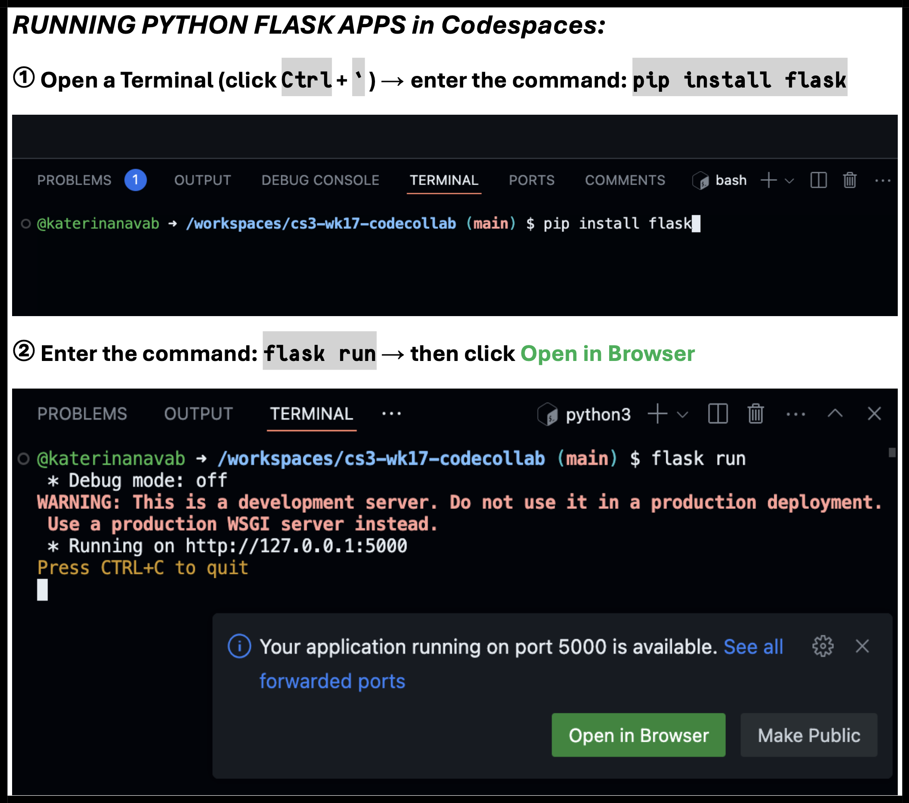

# CS3 Wk19 CodeCollab

This repository provides the **working program** for this week's **CodeCollab homework assignment**. 

### Instructions

1. Click `FORK` to make your own copy of the repo. You do not need to edit anything in the "Create a new fork" menu that comes up, just click `Create Fork`. _Forking a repository allows you to freely experiment with changes without affecting the original project._

2. Now on your own copy of the repo, click the green `<> CODE` button. Next, select the Codespaces tab and click `Create codespace on main`. _This will set up an IDE instance for you to run the program in._

3. In the Codespaces IDE, you can run the program, try to see how the code works, and experiment with it!
   
4. Write your **discussion post on Blackbaud** to complete the homework.

### Discussion Requirements

You must contribute at least **two (2) valid comments** in the Blackbaud discussion before `Friday @ 11:59PM` to earn full credit. See below for more detailed guidelines for what qualifies as an acceptable comment.

#### Checklist:
- [ ] At least one (1) of your comments must be a **paragraph-long post** where you analyze/attempt to explain a section of code. This is considered your "individual contribution" and it's the most important part of the assignment.
  * Focus on **small sections** - _DO NOT attempt to explain the entire program by yourself!_
  * This is a collaborative effort - _try to pick an area that no one else has talked about yet._
  * Be specific - _use line numbers and vocabulary terms when referring to code._

- [ ] At least one (1) of your comments must be a **direct reply on another classmate's post**.
  * Save this part for later in the week.
  * Your response must **extend the conversation** in some way - _like expanding on a concept brought up, giving another example, asking a question, sharing a relevant resource, etc_.

### Guidelines & Tips

* 🛠️ Start by tinkering with and manipulating the given code on your forked copy of the program to understand how it works. 
  * **Make small changes** one at a time, press `RUN`, then observe the resulting **output**. This process will help you visualize the **cause and effect** of different code instructions.
  * *EX:* A simple "experiment" you can always do is to **delete/comment-out a single line of code** then see what happens.
* 📝 When writing your discussion post, **describe your process** of tinkering with the code and present your **observations**. Seek to explain what your observations mean in terms of both higher-level objectives (*like programming & computational thinking concepts*) and lower-level objectives (_like syntax & vocabulary_).
  * *EX:* Explaining the overall goal / task achieved of a code section would count as a "higher-level objective"
  * *EX:* Observing the use and purpose of symbols such as curly braces `{ }` would count as a "lower-level objective"
* 📚 You are encouraged to **do research** and refer to the course notes, online textbooks, and reference websites like [W3Schools](https://www.w3schools.com/). Feel free to **include links** to relevant and helpful articles, images, and videos!
  * Sharing links is a particularly great way to supplement your "response" comment, especially if your classmate asked a question or brought up something that needs further clarification.
* 🔍 Keep in mind that a `CodeCollab` is an **exploratory** endeavor and you should approach it like an **experiment**. Work submitted will NOT be checked on "correctness" of responses, rather, the articulation of your thought process. Thus, it's less important that you get the "right answer" and more important that you record your thinking process as descriptively as possible.
  * _What did you notice about the code or the output?_
  * _What did you realize after changing part of the code?_
  * _What questions did it generate?_
  * _What parallels did you see?_
  * _What research did you do?_
